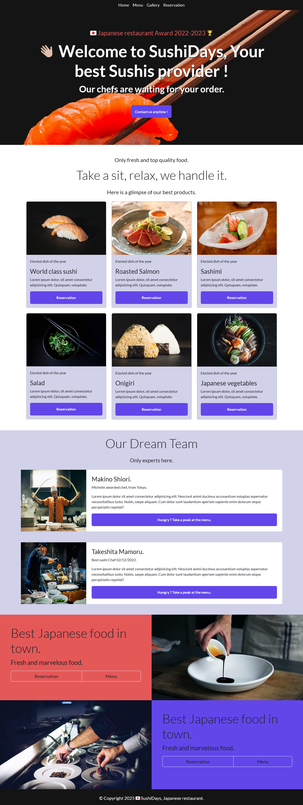
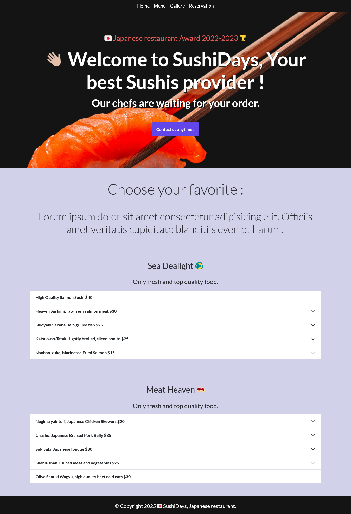
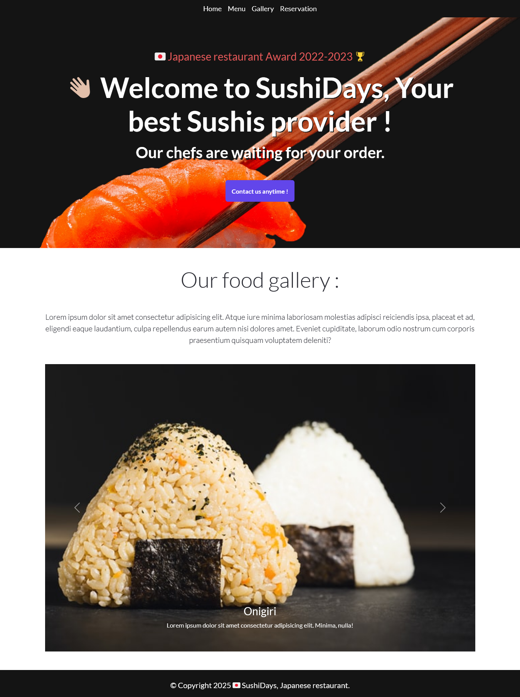
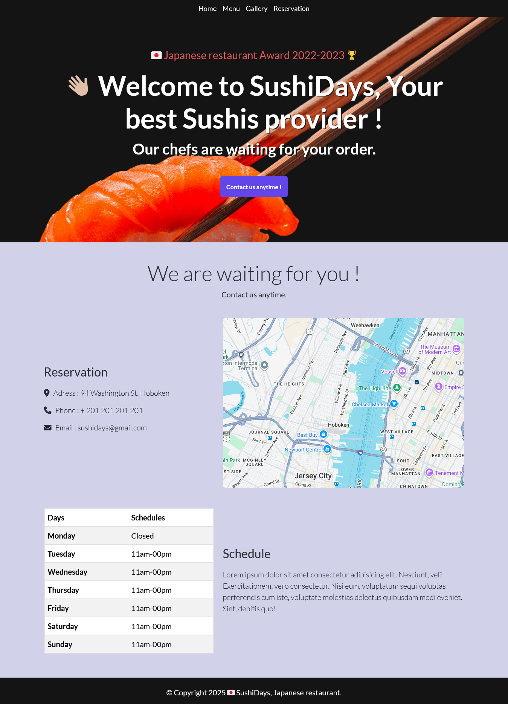

## 🥢 RESTAURANT JAPONAIS : SUSHIDAYS 🍣

Home :

Menu :

Gallery :

Reservation :

## Le challenge

Création d'un site complet de restauration japonaise SushiDays en HTML5, CSS3, JavaScript et Bootstrap. Ce site comprend 4 pages :

- la page Home
- la page Menu
- la page Gallery
- la page Reservation

## Démonstration

Lien vers le projet : https://aperbet56.github.io/restaurant_japonais/

## Projet développé avec

- Utilisation des balises sémantiques HTML5
- CSS3
- Flexbox
- Bootstrap
- Importation de la police "Lato"
- Animations CSS
- Page web responsive
- Desktop first
- JavaScript
- Code JavaScript commenté
